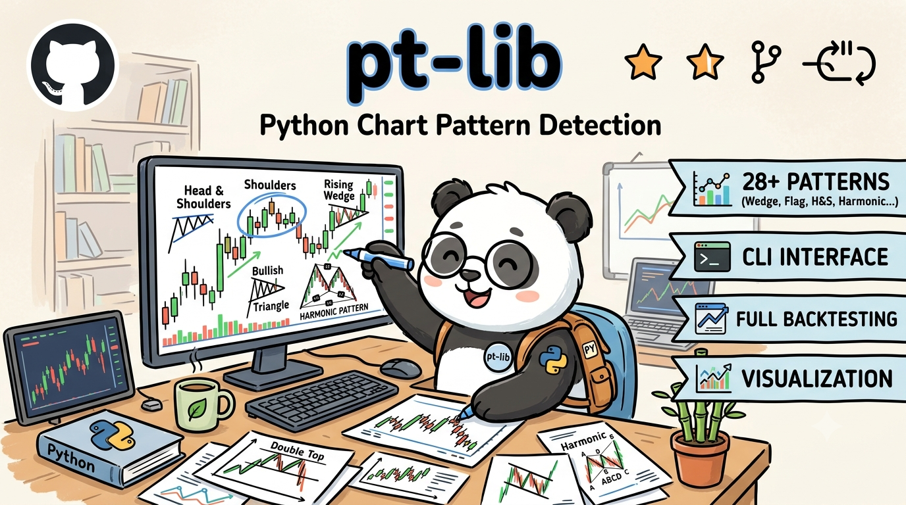

# pt-lib — Chart Pattern Detection Library

<p align="center">
  
</p>

**pt-lib** is a Python chart pattern detection library built on the [stock-pattern](https://github.com/benny-thadikaran/stock-pattern) framework, and inspired by [PatternPy](https://github.com/khuyentran1401/PatternPy) / [TradingPatternScanner](https://github.com/khuyentran1401/TradingPatternScanner). It covers **28 pattern types** (including harmonics) with a unified CLI, backtesting, and visualization — all in one package.

> The name pays homage to TA-Lib: **pt-lib** = **P**attern **T**rade **Lib**rary.

---

## Features

- **28 patterns** across 11 categories — H&S, Double T/B, VCP, Flag, Triangle, Trend Lines, Wedge, Channel, Multiple T/B, S/R, and 10 Harmonic patterns
- **4 exclusive pattern families** not found in stock-pattern: Wedge, Channel, Multiple T/B, Horizontal S/R
- **Pivot + geometric constraint** detection — more robust than rolling-window approaches
- **CLI** with interactive mode, bulk scan, and grouped pattern scanning (all, bull, bear, bull_harm)
- **Backtesting** engine with look-ahead/look-back periods
- **Visualization** powered by mplfinance
- **Production-quality** — inherited and extended from stock-pattern's well-tested pivot framework

---

## Pattern Overview

| Category | Patterns | Key(s) | Origin |
|----------|----------|--------|--------|
| **H&S** | Head & Shoulders / Inverse H&S | `hnsd` / `hnsu` | stock-pattern |
| **Double T/B** | Double Top / Double Bottom | `dtop` / `dbot` | stock-pattern |
| **VCP** | Volatility Contraction (Bull/Bear) | `vcpu` / `vcpd` | stock-pattern |
| **Flag** | Bullish / Bearish Flag | `flagu` / `flagd` | stock-pattern |
| **Triangle** | Symmetric / Ascending / Descending | `trng` | stock-pattern |
| **Trend Line** | Uptrend / Downtrend Line | `uptl` / `dntl` | stock-pattern |
| **Harmonic** | AB=CD / Bat / Gartley / Crab / Butterfly (Bull & Bear) | `abcdu` ~ `bflyd` (10 keys) | stock-pattern |
| **Wedge** ✨ | Falling Wedge (Bullish) / Rising Wedge (Bearish) | `wedgu` / `wedgd` | **pt-lib** |
| **Channel** ✨ | Channel Up (Bullish) / Channel Down (Bearish) | `chnlu` / `chnld` | **pt-lib** |
| **Multiple T/B** ✨ | Multiple Top (Bearish) / Multiple Bottom (Bullish) | `mltp` / `mltb` | **pt-lib** |
| **S/R** ✨ | Horizontal Support & Resistance | `supr` | **pt-lib** |

> ✨ = New patterns added in pt-lib that were missing from stock-pattern.

---

## Installation

```bash
git clone https://github.com/tan-yang/pt-lib.git
cd pt-lib
pip install -r requirements.txt
```

First-time setup — configure your data path:

```bash
cd src
python setup-config.py
```

### Data Format

Each symbol should have a CSV file in your `DATA_PATH` directory with columns: **Date, Open, High, Low, Close, Volume**. The file name (without extension) is used as the symbol key.

---

## CLI Usage

All commands run from the `src/` directory.

### Scan a Specific Pattern

```bash
python init.py -p wedgu -f symlist.txt      # Falling Wedge
python init.py -p chnlu -f symlist.txt       # Channel Up
python init.py -p supr -f symlist.txt        # S/R Levels
```

### Scan Pattern Groups

```bash
python init.py -p all -f symlist.txt         # All classical patterns
python init.py -p bull -f symlist.txt        # All bullish patterns
python init.py -p bear -f symlist.txt        # All bearish patterns
python init.py -p bull_harm -f symlist.txt   # All bullish harmonic patterns
```

### Interactive Mode

Omit the `-p` flag to use an interactive prompt:

```bash
python init.py -f symlist.txt
```

### Backtesting

```bash
python backtest.py -p wedgu -d 2024-10-20 --period 60
```

### Common Options

| Flag | Description | Default |
|------|-------------|---------|
| `-l` / `--left` | Candles to the left of pivot | 6 |
| `-r` / `--right` | Candles to the right of pivot | 6 |
| `--save` | Save chart as PNG | — |
| `--plot` | Re-plot from saved JSON results | — |

### symlist.txt Format

One symbol per line, matching your CSV file name (without extension):

```
AAPL
MSFT
GOOGL
TSLA
```

---

## Python API

```python
from utils import get_max_min
from patterns_extended import find_bullish_wedge, find_support_resistance

# OHLCV DataFrame
df = pd.read_csv("data/AAPL.csv", index_col=0, parse_dates=True)

# Extract pivot points
pivots = get_max_min(df)

# Detect Falling Wedge
result = find_bullish_wedge("AAPL", df, pivots, {})
if result:
    print(f"Detected: {result['pattern']} ({result['alt_name']})")
    print(f"Points: {result['points']}")

# Detect Support / Resistance
sr = find_support_resistance("AAPL", df, pivots, {})
if sr:
    print(f"{sr['alt_name']} at {sr['extra_points']['level_start'][1]:.2f}")
```

### Return Format

Every detection function returns `Optional[dict]`:

```python
{
    "sym": "AAPL",                            # Symbol
    "pattern": "WEDGU",                       # Pattern key
    "alt_name": "Falling Wedge",              # Human-readable name
    "start": Timestamp(...),                  # Pattern start date
    "end": Timestamp(...),                    # Current date
    "df_start": Timestamp(...),               # Data start
    "df_end": Timestamp(...),                 # Data end
    "points": {                               # Label points
        "A": (Timestamp, price),
        "B": (Timestamp, price),
        ...
    },
    "extra_points": {                         # Lines for plotting
        "upper_start": (Timestamp, price),
        "upper_end": (Timestamp, price),
        ...
    },
}
```

---

## Extended Pattern Detection

Unlike the rolling-window extremum comparison used in PatternPy, pt-lib detects all 4 extended pattern families using **pivot points + geometric trend-line constraints**:

| Pattern | Detection Logic |
|---------|----------------|
| **Falling Wedge** | 2 highs & 2 lows both descending; upper trend-line slope < lower slope → convergence |
| **Rising Wedge** | 2 highs & 2 lows both ascending; upper trend-line slope < lower slope → convergence |
| **Channel Up** | 2 highs & 2 lows both ascending; slope difference < 30% → parallel |
| **Channel Down** | 2 highs & 2 lows both descending; slope difference < 30% → parallel |
| **Multiple Top** | 3+ highs cluster within 5% price range; price has not broken out |
| **Multiple Bottom** | 3+ lows cluster within 5% price range; price has not broken down |
| **S/R Levels** | Pivot points cluster within adaptive thresholds; pick the level with the highest touch count |

All patterns check whether price has already broken through the trend-line or level — confirmed breakouts are excluded.

---

## Project Structure

```
pt-lib/
├── src/
│   ├── init.py                 # CLI entry point
│   ├── backtest.py             # Backtesting engine
│   ├── utils.py                # Core detection (stock-pattern)
│   ├── patterns_extended.py    # Extended patterns (Wedge, Channel, Multi T/B, S/R)
│   ├── Plotter.py              # mplfinance visualization
│   ├── setup-config.py         # Configuration setup
│   ├── loaders/                # Data loaders
│   │   ├── AbstractLoader.py
│   │   ├── EODFileLoader.py
│   │   └── IEODFileLoader.py
│   └── user.json               # User config
├── tests/
│   ├── test_extended_patterns.py  # 10 tests for extended patterns
│   └── ...
└── requirements.txt
```

---

## License

GNU General Public License v3.0 — inherited from [stock-pattern](https://github.com/benny-thadikaran/stock-pattern).
